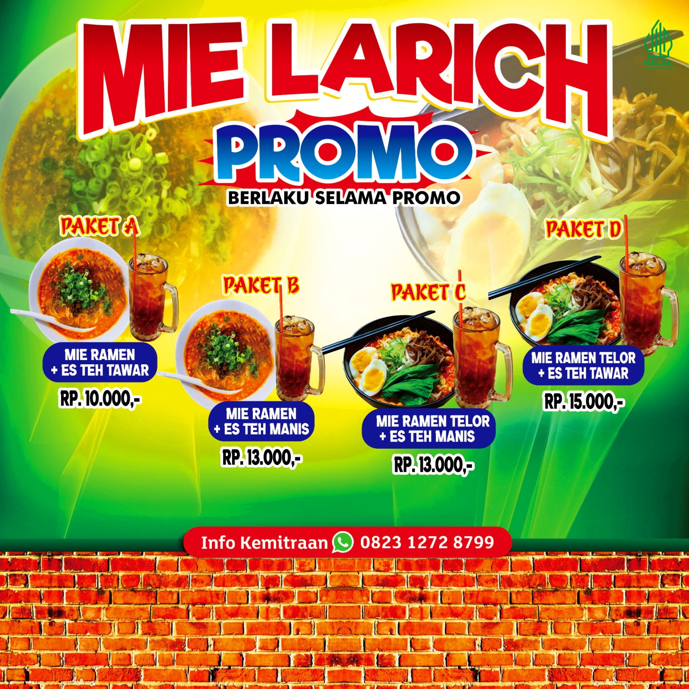
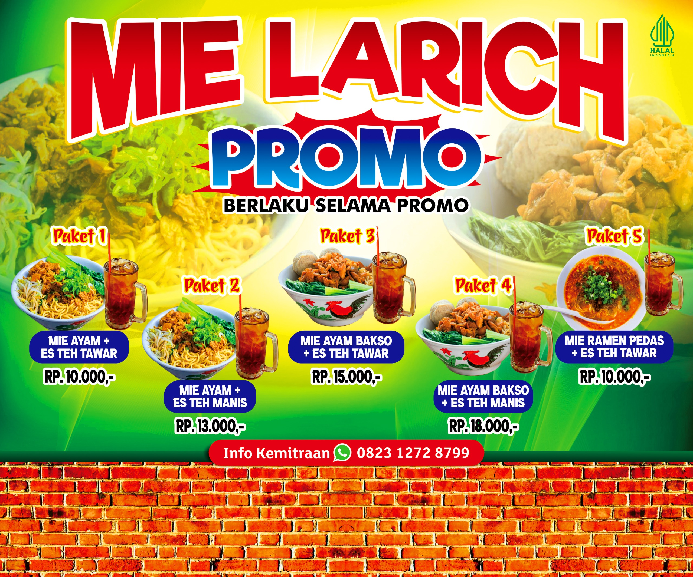
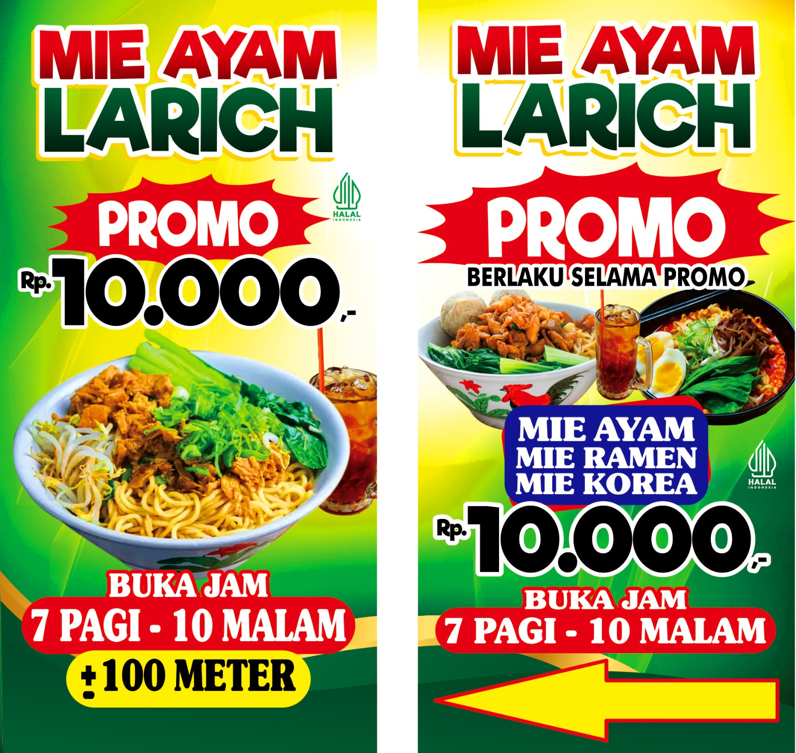
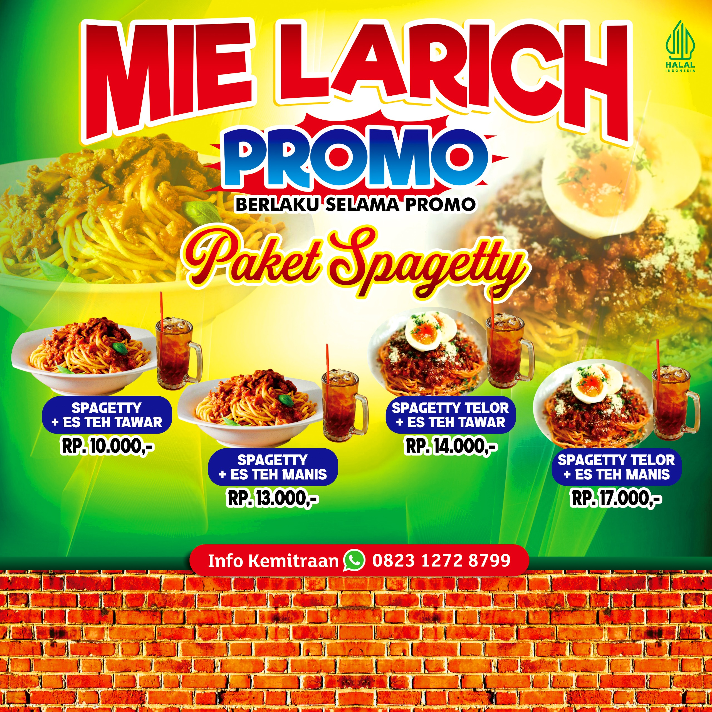

<!DOCTYPE html>
<html lang="id">
<head>
  <meta charset="UTF-8">
  <meta name="viewport" content="width=device-width, initial-scale=1.0">
  <title> Mie Ayam </title>
      <link
      href="https://fonts.googleapis.com/css2?family=Dancing+Script&display=swap">
  <link rel="stylesheet" href="style-zip.css">
</head>
<body>
  <!-- Header -->
  <header class="header">
    <h1>Mie Ayam Larich</h1>
    
Harga mulai Rp10.000

  </header>

  <!-- Menu Section -->
  <section class="menu-section">
    <h2 class="section-title">Menu Mie Ayam<p1>Tanpa Pengawet</p1></h2>
    
    

      

        
        <h3>Mie Ayam Pedas</h3>
        
Mi pedas dengan topping ayam pedas khas Korea

        
Rp10.000

      

      

        
        <h3>Mie Ayam Keju</h3>
        
Mi lembut dengan keju meleleh dan ayam renyah

        
Rp12.000

      

      

        
        <h3>Mie Ayam Original</h3>
        
Mi klasik dengan topping ayam khas Indonesia

        
Rp10.000

      

      

        
        <h3>Mie Ayam Saus Korea</h3>
        
Mi dengan saus manis pedas khas Korea

        
Rp11.000

      

    

  </section>

  <!-- pesan  -->
<section class="chat-section">
  <h2 class="section-title">Hubungi Kami</h2>
  <form class="chat-form" action="https://formspree.io/f/movqdbld" method="POST" id="chatForm">
    <input type="text" name="name" placeholder="Nama Anda" required>
    <input type="text" name="Alamat" placeholder="Alamat" required>
    <input type="tel" name="phone" placeholder="No HP Anda" required>
    <textarea name="message" placeholder="Ketik" required></textarea>
    <button type="submit">Kirim</button>
  </form>
</section>

    <footer>
        

            

                
<i class="fas fa-map-marker-alt"></i>Almuslim

                
<i class="fas fa-phone-alt"></i> Call: +6289512595271

                
<i class="fas fa-envelope"></i>almuslimkarpet@gmail.com

            

            

                <h3>Usefull Link</h3>
                <ul>
                    <li><a href="#">almuslim</a></li>
                    <li><a href="#">Baittulmuslim</a></li>
                    <li><a href="#">Design</a></li>
                    <li><a href="#">policy</a></li>
                </ul>
            

            

                <h3>Repair</h3>
                
The awards for design, creativity and innovation on the
                website’and aplication for you.

            

            

                <h3>Social Media</h3>
                

                    <a href="#"><i class="fab fa-facebook-f"></i></a>
                    <a href="#"><i class="fab fa-twitter"></i></a>
                    <a href="#"><i class="fab fa-google-plus-g"></i></a>
                    <a href="#"><i class="fab fa-linkedin-in"></i></a>
                

            

            

                <h3>Our Repair Center</h3>
                
The awards for design, creativity and innovation on the Internet’

            

        

        

            
2024 All Rights Reserved. Design by zipmsi

            <a style="color:#fff;">Belikan pengembang coffe</a>
        

    </footer>
    

  <!-- JavaScript -->
  
</body>
</html>
